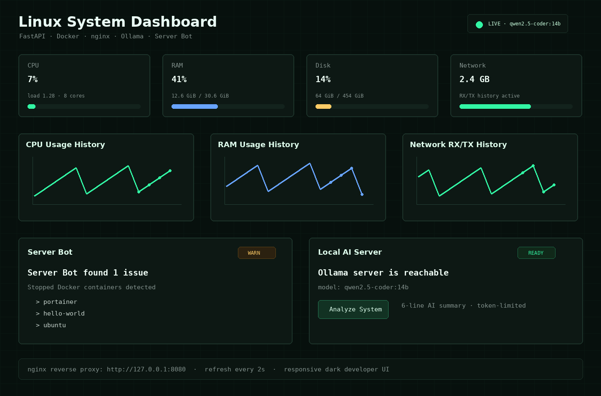

# Linux System Monitor

[](https://github.com/jiyoon99/linux-system-monitor/actions/workflows/ci.yml)

FastAPI, Docker, nginx, Chart.js, Ollama를 조합해 만든 Linux 서버 실시간 모니터링 대시보드입니다. 단순 지표 표시를 넘어서 Docker 런타임 상태, 자동 점검 봇, 로컬 LLM 기반 시스템 분석까지 한 화면에서 확인할 수 있도록 구성했습니다.



## Project Highlights

- 실시간 CPU, RAM, Disk, Network 모니터링
- Chart.js 기반 CPU/RAM/Network 히스토리 그래프
- Docker daemon, container, image 상태 표시
- Server Bot 자동 점검
  - CPU/RAM/Disk 임계치 감시
  - 중지된 컨테이너 감지
  - `OK`/`WARN`/`FAIL` 상태 리포트
- Ollama 로컬 AI 서버 연동
  - Ollama 연결 상태 확인
  - 설치된 모델 목록 표시
  - 현재 시스템 상태 AI 분석
- nginx reverse proxy와 Docker Compose 기반 실행
- 다크 테마 반응형 UI
- 웹 대시보드와 CLI 동시 지원

## For Interviewers

이 저장소는 Linux 서버 상태를 "명령어 여러 개"가 아니라 하나의 운영 화면에서 판단하도록 만든 프로젝트입니다.

| 평가 포인트 | 확인 위치 |
| --- | --- |
| Linux metrics 수집 | `src/linux_dashboard/metrics.py`, `/proc`, `/sys`, disk/network 정보 |
| Docker 운영 상태 확인 | Docker socket mount, container/image 상태 API |
| 웹 서비스 구성 | FastAPI app, nginx reverse proxy, Docker Compose |
| 운영 판단 로직 | Server Bot `OK`/`WARN`/`FAIL` 리포트 |
| AI 연동 | Ollama 상태 확인과 현재 시스템 상태 분석 API |

면접에서 설명할 수 있는 핵심은 다음과 같습니다.

- 컨테이너 안에서 호스트의 `/proc`, `/sys`, Docker socket을 읽을 때 어떤 권한과 mount가 필요한지
- 단순 수치 표시와 운영자가 바로 판단할 수 있는 alert/report의 차이
- nginx를 앞에 두고 FastAPI 앱을 내부 포트로 분리한 이유
- Ollama가 느리거나 꺼져 있을 때 대시보드 전체가 멈추지 않도록 상태 API를 나눈 방식

## Why I Built This

개인 Linux 개발 환경에서 Docker, Ollama, 시스템 리소스 상태를 매번 여러 명령어로 확인하는 불편함을 줄이기 위해 만들었습니다.

이 프로젝트는 다음 문제를 해결합니다.

- `docker ps`, `free`, `df`, `top`, `curl localhost:11434`를 각각 실행해야 하는 번거로움
- 컨테이너가 중지돼도 바로 알아차리기 어려운 문제
- 리소스 수치만 보고 판단해야 하는 운영 피로도
- 로컬 AI 서버 상태와 모델 설치 여부를 별도로 확인해야 하는 문제

## Tech Stack

| Area | Stack |
| --- | --- |
| Backend | Python 3.12, FastAPI, psutil, Jinja2 |
| Frontend | HTML, CSS, JavaScript, Chart.js |
| Runtime | Docker, Docker Compose, nginx |
| AI integration | Ollama local LLM API |
| Monitoring | `/proc`, `/sys`, Docker socket |

## Architecture

```text
Browser
  -> nginx reverse proxy (:8080)
  -> FastAPI app (:18000, host network)
  -> Linux host metrics (/proc, /sys, /)
  -> Docker Engine (/var/run/docker.sock)
  -> Ollama API (localhost:11434)
```

FastAPI 앱과 nginx는 `network_mode: host`로 실행됩니다. Portainer가 `8000` 포트를 사용 중인 환경에서도 충돌하지 않도록 FastAPI 앱은 `18000` 포트에 바인딩하고, nginx는 외부 접속용 `8080` 포트를 사용합니다.

## Current Runtime

현재 기본 실행 주소:

```text
http://127.0.0.1:8080
```

기본 포트:

| Service | Port | Purpose |
| --- | ---: | --- |
| nginx | 8080 | Browser entrypoint |
| FastAPI app | 18000 | Internal dashboard API |
| Ollama | 11434 | Local LLM API |

## Quick Start

```bash
docker compose up -d --build
```

상태 확인:

```bash
docker compose ps
curl http://127.0.0.1:8080/healthz
curl http://127.0.0.1:8080/api/metrics
```

브라우저에서 접속:

```text
http://127.0.0.1:8080
```

## Local Development

```bash
python3 -m venv .venv
source .venv/bin/activate
pip install -e .
linux-dashboard-web
```

로컬 개발 서버:

```text
http://127.0.0.1:8000
```

CLI:

```bash
linux-dashboard
linux-dashboard --once --top 10
```

## Docker Compose Notes

핵심 설정:

```yaml
services:
  app:
    network_mode: host
    command: ["--host", "0.0.0.0", "--port", "18000"]
    environment:
      OLLAMA_BASE_URL: http://localhost:11434
      OLLAMA_MODEL: qwen2.5-coder:14b
    volumes:
      - /proc:/host/proc:ro
      - /sys:/host/sys:ro
      - /:/host/root:ro
      - /var/run/docker.sock:/var/run/docker.sock:ro

  nginx:
    network_mode: host
```

nginx upstream:

```nginx
upstream linux_dashboard_app {
    server 127.0.0.1:18000;
}
```

## Ollama Integration

Ollama API 확인:

```bash
curl http://localhost:11434/api/tags
```

모델 다운로드:

```bash
ollama run qwen2.5-coder:14b
```

대시보드는 `/api/ollama/status`로 서버와 모델 상태를 확인하고, `/api/ollama/analyze`에서 현재 CPU/RAM/Disk/Docker 상태를 Ollama에 전달해 짧은 한국어 분석 결과를 받습니다.

## API

| Method | Endpoint | Description |
| --- | --- | --- |
| `GET` | `/` | Dashboard UI |
| `GET` | `/healthz` | Health check |
| `GET` | `/api/snapshot` | Single system snapshot |
| `GET` | `/api/metrics` | Current metrics with history |
| `GET` | `/api/alerts` | Server Bot report |
| `GET` | `/api/ollama/status` | Ollama connection status |
| `GET` | `/api/ollama/models` | Installed Ollama models |
| `POST` | `/api/ollama/analyze` | AI system analysis |

AI 분석 요청:

```bash
curl -X POST http://127.0.0.1:8080/api/ollama/analyze \
  -H 'Content-Type: application/json' \
  -d '{}'
```

## Validation

```bash
python3 -m compileall src
docker compose config
docker compose up -d --build
curl http://127.0.0.1:8080/healthz
curl http://127.0.0.1:8080/api/ollama/status
```

Expected healthy signals:

- `/healthz` returns `{"status":"ok"}`
- Docker Compose shows `linux-dashboard-app` as healthy
- `/api/ollama/status` reports `server_status: running`
- `default_model_available` is `true` when `qwen2.5-coder:14b` is installed

## Troubleshooting

### Port already in use

FastAPI는 `18000`, nginx는 `8080`을 사용합니다. 충돌이 있으면 `docker-compose.yml`과 `nginx/default.conf`를 함께 수정해야 합니다.

### Ollama server offline

```bash
curl http://localhost:11434/api/tags
ollama serve
```

systemd 환경:

```bash
sudo systemctl start ollama
sudo systemctl status ollama
```

### Model not found

```bash
ollama run qwen2.5-coder:14b
```

### Docker status degraded

Docker socket 마운트와 권한을 확인합니다.

```yaml
volumes:
  - /var/run/docker.sock:/var/run/docker.sock:ro
```

중지된 테스트 컨테이너가 많으면 Server Bot이 `WARN`을 표시합니다.

```bash
docker ps -a --filter status=exited
docker rm <container_id>
```

## Roadmap

- AI 분석 결과 캐싱
- 최근 분석 히스토리 저장
- Server Bot alert acknowledge 기능
- 컨테이너별 CPU/RAM 상세 모니터링
- Prometheus/Grafana export endpoint
- WebSocket 기반 push 업데이트
- GitHub Actions 테스트 범위 확대
- 운영 서버 배포 예제 추가
